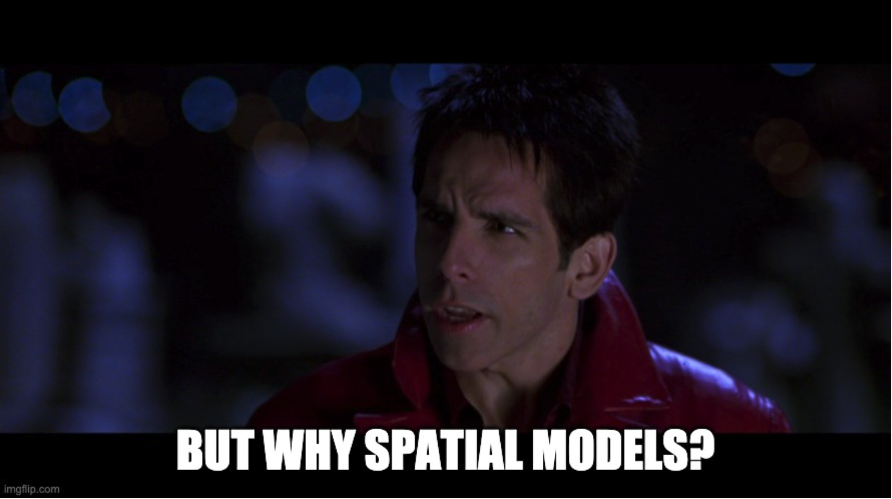

```{r setup, include=FALSE}
knitr::opts_chunk$set(echo = FALSE)
library(tidyverse)
theme_set(theme_bw() + theme(text=element_text(size=22)))
```

# The Ordinary Linear Model

One of the very first models introduced in basic statistics curriculum 
is the "ordinary linear model" shown below with three unknown variables: 
$\alpha,\beta$ and $\sigma^2$: 

$$
y_i = \alpha + \beta x_i + \epsilon_i\\
\epsilon_i \stackrel{ind}{\sim} N(0,\sigma^2), \quad i=1,...,n.
$$

This is one of the cornerstone models in applied statistics and for good reason,
a lot of relationships are linear, or at least approximately, and it offers 
an interpretable way to understand and test scientific hypotheses about reality.


```{r,fig.cap="Scatter plot with true linear model overlaid."}
n <- 20
x <- rnorm(n)
alpha <- 5
beta <- 2
sigma <- 1
epsilon <- rnorm(n,mean=0,sd=sigma)
y <- alpha + beta*x + epsilon
tibble(y=y,x=x) %>% 
  ggplot(aes(y=y,x=x)) + 
  geom_point() + 
  geom_abline(intercept = alpha,slope = beta) + 
  ggtitle("An Ordinary Linear Model")
```

Ordinary linear models are great, I love and use them all the time. However,
there is a key assumption when writing that cute little "ind" in  the
$\epsilon \stackrel{ind}{\sim} N(0,\sigma^2)$ that can cause us all sorts of problems.

## Assuming Independence

By writing those three little letters on top of that little squiggly line,
we're making a *strong* assumption about how we think those data are 
generated. In effect, we're saying that each $y_i$ does not in anyway depend on 
any other $y_i'$, or more formally $P(y_i|y_{i'}) = P(y_i)$: the probability 
of $y_i$ being equal to some value is the same whether we observe $y_{i'}$ 
or not!


## Mixed Effects Models


This still leaves us asking a question though.


#  Spatial Models

Spatial models, as well as many other classes of models, loosen this assumption
by assuming *some* form of dependence between the observations, now usually 
given a second subscript to denote their spatial dependence, e.g. $y_{ij}$. The 
manner in which this dependence or correlation between observations 
is formed depends on both the system under study as well as the data collected.

Considering this a blog focused on the built environment we'll first focus 
on a spatial model that will allow us to model correlation across a network
of city streets: The Conditional Auto Regressive or CAR Model.

## CAR models


### Further reading

* See chapter blah in  "Hierarchical Modeling and Analysis for Spatial Data" by
Banerjee, Carlin and Gelfand. 
* There is a nice write up on this topic with particular attention paid to
implementation details in stan and an application for disease and demography 
modeling [here](https://mc-stan.org/users/documentation/case-studies/icar_stan.html).