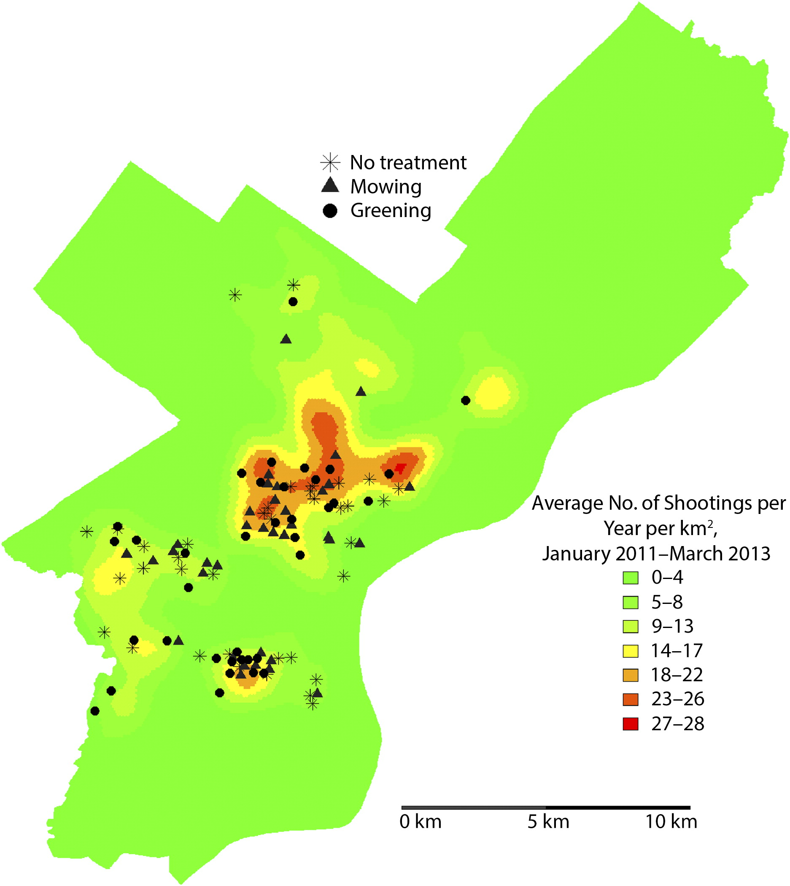

```{r setup, include=FALSE}
knitr::opts_chunk$set(echo = FALSE)
library(tidyverse)
library(gt)
library(sf)
```
# Context

In the previous post we discussed this fantastic article, [@moyer2019effect] 
, which studied how different cleaning "interventions" applied to vacant lots
had the potential to affect the propensity for nearby violent shootings.
In this post we'll look at the specific measures and statistical methods 
they used to analyze their data in order to test this hypothesis and break down 
the methods' various advantages and disadvantages.

# Methods  


## Data and Questions

Recall from the paper that the authors had shooting data accessed
from the Philadelphia Police Department, and vacant lot data - location, size,
and randomized intervention, that they amassed 
as part of their project. I've already shown, visually, what the
shooting data looked like in the first post. As for the vacant lot data, it 
probably looked something like what's in Table \@ref(tab:vacant).

```{r vacant}
vldf <- tibble(`Lot Cluster ID` = 1:5,
               Intervention = c("Greening","Mowing",
                                "Greening","Control",
                                "Control"),
               Latitude = rep(0,5), ## comment on this if not able 
               Longitude = rep(0,5)) ## to get data access
vldf %>% 
  gt(caption = "Hypothetical Vacant Lot Data")
```

But all this begs the question, if we have lots at one location, and 
shootings at another, how do we relate the two to each other? The authors 
propose two methods, the first involving a kernel density estimate and the 
second involving a count of the number of shootings inside a "Buffer" Zone
around the vacant lot.

##  Kernel Density Estimates 

What's a kernel density estimate(KDE)? Simply put, it is a fancy word for a 
fancy kind of average^[This describes most of the work 
done in Statistics.]. The author's created a grid of points
across the polygonal space defined by Philadelphia's borders and at each grid 
point took a weighted average of the number of shootings during the time period,
e.g. month, of interest. They chose a bandwidth of 500 meters, which 
essentially means that shootings within that distance were weighted more
than those further away. We can't know which kernel they used
because they don't state it explicitly, but of the many 
[options](https://en.wikipedia.org/wiki/Kernel_(statistics)) 
they may have chosen the rectangular kernel, as they state many of their 
estimates in terms of Crimes per km$^{2}$. For illustrative purposes, 
you can see this kernel below with bandwidth $b$ for location 
$\mathbf{s}=(s_a,s_b)$^[Where $s_a,s_b$ are e.g. latitude and longitude],

$$
\mathcal{K}_b(\mathbf{s},\mathbf{s}') = 
\begin{cases}
\frac{1}{b}  & d(\mathbf{s},\mathbf{s}') \leq b \\
0 & \text{otherwise}
\end{cases}
$$
where $d(\mathbf{s}_1,\mathbf{s}_2)$ is the distance between the two locations. 
The KDE,$\hat{y}$ at an arbitrary location $\mathbf{s}$ for a given 
month would then combine all $i=1,...n$ shooting samples as follows:

$$
\hat{y}(\mathbf{s}) = \frac{\sum_{i=1}^{n}\mathcal{K}_b(\mathbf{s}, 
\mathbf{s}'_i)y_i(\mathbf{s'})}{\sum_{i=1}^{n}\mathcal{K}_b(\mathbf{s},
\mathbf{s}'_i)}.
$$

What this amounts to conceptually is an average number of shootings at each
grid point, where those shootings at closer distances are weighted more and 
those shootings at further distances (especially those more than 500 m) are 
weighted less. The authors create their main figure in the paper
from plotting the relative averages at each grid point across space. The lower
values are assigned a light green color and the higher values are assigned a 
red color. See Figure \@ref(fig:kde) from their 
paper[@moyer2019effect].

```{r kde,fig.width=8,fig.height=10,fig.cap="Kernel Density Estimate of shootings Figure from [@moyer2019effect]."}
## See PNAS copyright policy here: https://www.pnas.org/content/101/34/12399
## As this blog is currently non-commercial this image is used according to 
## the following language:
## "Our guiding principle is that, while PNAS retains copyright, 
## anyone can make noncommercial use of work in PNAS without asking our 
## permission, provided that the original source is cited." 
##  Publication is cited throughout this paper as well as in this 
## figure's caption.

```

As you can see, the kernel density estimate gives us this nice visualization 
and a decent conceptualization of the vacant lots that are most prone to having 
shootings nearby, but what are the disadvantages, if any?

### Pros and Cons

As stated previously, the KDE has a number of advantages, including the ability
to nicely visualize across continuous space, the relative "amount" of 
shootings at each location. However, it has a number of drawbacks too. 
The first, is that we don't know if it's a particularly good estimate. If you
recall, the author's chose a certain bandwidth of 500m, but wouldn't 400m have 
been just as good? This is a well established problem in this space known as 
the modifiable areal unit problem [@fotheringham1991modifiable].
Further, while the idea of a KDE of shootings can be nicely 
visualized, as in Figure \@ref(fig:kde), it can be difficult to communicate 
verbally to stakeholders:  

"Ah yes, you see when we cleaned up these vacant lots we found that 
the average number of shootings at the vacant lot decreased as measured by 
this kernel density estimate, which takes into account a weighted
average of those shootings that are nearby. What do I mean by nearby and
how did I choose the weights?
Well the weights and proximity are defined according to this kernel and 
bandwidth measure we chose...".

You get the picture. It would be much easier to say, did the average number of shootings at 
location "x" go down or not? However, this can be much harder to model,
so the author's, understandably,  went with the KDE. The outcome in their first 
model, $Y_{it}$, was consequently defined as follows:


$$ 
Y_{it} := \text{ KDE at lot } i\text{, in study month } t. \\
$$

## Buffer Counts 

The second measure the author's use to try and assign a specific number of
shootings to a vacant lot is known as a "buffer count" or "buffer zone". Put
simply, the author's looked at the center of each vacant lot, drew a circle
300 meters around that point, and counted all the shootings that fell into
that circle, during a given month and assigned that value to the vacant lot
as it's count of shootings, $Y_{it}'$. 
See Figure \@ref(fig:buffervis) for a visualization of this idea. The authors 
then went on to check for "spill-over" effects through the use of 
a second, 600m buffer around the first.

```{r buffervis,preview=TRUE,fig.cap="Visualization of Hypothetical Buffer with 300 m radius in Upper Kensington. Star represents location of hypothetical vacant lot.",fig.width=14,fig.height=8}
uk <- read_sf("~/Documents/CityData/Philly/geo-data/Neighborhoods_Philadelphia/Neighborhoods_Philadelphia.shp") %>%
  filter(MAPNAME == "Upper Kensington")  %>% 
  st_transform(4326)

shootings <- read_csv("~/Documents/CityData/Philly/Crime/shootings_2015_2020.csv") %>% 
  filter(!is.na(point_x),!is.na(point_y)) %>% 
  filter(point_x > -80,
         year==2015,
         officer_involved=="N") %>% 
  st_as_sf(coords = c("lng","lat")) %>% 
  st_set_crs(4326) %>% 
  select(year) %>% 
  st_filter(uk)

streets <- read_sf("~/Documents/CityData/Philly/CompleteStreets-shp/CompleteStreets.shp") %>% 
  st_filter(uk)

hypothetical_lot <- st_centroid(uk)

buffer <- st_buffer(hypothetical_lot,dist = units::as_units(300,"m"))

p1 <- uk %>% 
  st_join(streets,join=st_contains) %>% 
  ggplot() + 
  geom_sf(linetype=2) + 
  geom_sf(data=streets) + 
  geom_sf(data=shootings,color='red') + 
  geom_sf(data=hypothetical_lot,color='blue',shape='*',size=10) + 
  geom_sf(data=buffer,color='darkgreen',alpha=0) + 
  theme_void() + 
  theme(text = element_text(size=22)) + 
  labs(caption = "Data sourced from OpenDataPhilly.org")

p1
```


### Pros and Cons

The buffer count has a very appealing interpretation, it's  simply the number
of shootings within a certain distance of the 
location of interest. This is **much** easier to explain to stakeholders, 
and others who may be interested in this work, but not interested in learning 
about kernels and bandwidths. It can also be seen as a kind of 
kernel density estimate, except now we're taking an unweighted, unnormalized
average^[also called a sum]. However, similar to the kernel density estimate,
it suffers from having to choose some *ad hoc* distance, 
300 (or 600 for spillover) meters in this case, as the "correct" distance 
within which to count shootings. This remains a major drawback.

<aside>
There have been developments in the statistics literature to try and address 
these issues that we'll discuss in detail at another point in time. See
[@baek2016distributed],[@peterson2021spatial], and [@peterson2021heterogeneous] 
if you'd like to learn more now.
</aside>

$$
Y_{it}' = \text{# of shootings within 300m of vacant lot } i \text{ during month } t 
$$

## Difference in Differences 

Now that we have our two outcome measures constructed from the shooting data 
and vacant lot locations, we can turn to modeling the potential effects of the
vacant lot cleanup intervention. The author's estimate a 
"Difference-in-Differences"(DnD) of the expected number of shootings at the lots 
that receive either the "greening" or "mowing" intervention. This is a very
specific estimate that we'll elaborate on in more detail in the causal 
inference post, but for now it suffices to say they're comparing the *same* 
vacant lots before and after receiving the interventions, *as opposed to* 
comparing those lots that received interventions and the control. There 
may or may not be good reasons for not estimating this latter contrast but 
we'll save that discussion for the causal-inference post. For now,
let's break down this big equation from the initial post and try to understand
how they calculate the difference-in-difference estimate for the greening 
intervention^[I omit the distributional assumptions on the random  
effects and epsilon term here for space. They are all distributed 
Normal with mean zero and unknown variance.];

\begin{equation}
\begin{aligned}
Y_{it} &= \beta_0 + \beta_1 \text{Greening}_i + \beta_2\text{Mowing}_i
+ \beta_3\text{Post}_t + \beta_4\text{AllTreated}_i  \\
&+ \beta_5 \text{Greening}_i \times \text{Post}_t + 
\beta_6\text{Mowing}_i \times \text{Post}_t  \\
&+ \beta_7\text{Greening}_i\times \text{AllTreated}_t + 
\beta_8\text{Mowing}_i \times \text{AllTreated}_t \\
&+ \alpha_{m(t)} + \delta_{s(i)} + \xi_{c(i)} + \epsilon_{it},
\end{aligned}
(\#eq:dnd)
\end{equation}


<aside>
This equation uses the notion of indicator functions. That is, Greening$_i$
is either a 0 or 1 for lot $i$. 1 indicates the lot received the greening 
intervention and 0 indicates it did not. Post$_t$ is the same where a 1 
indicates the measurement was recorded after the intervention was administered 
and vice versus. 
</aside>

From \@ref(eq:dnd), we can see that the expected number of shootings
for a greening lot prior and subsequent to the intervention is represented by
$\beta_0 + \beta_1$, and $\beta_0 + \beta_1 + \beta_5$, respectively. 
If we want to know the difference then, 
in the expected number of shootings for the same vacant lots assigned to the 
greening intervention before and after the trial, we simply take the difference 
between these two equations which gives us $\beta_5$. Our estimate of 
this quantity, $\hat{\beta}_5$, is the estimated effect of 
the greening intervention. Similarly, $\hat{\beta_6}$ is the estimated effect of the 
mowing intervention.

Of course, in statistics it isn't sufficient to just calculate a point estimate,
like $\hat{\beta}_5$, and call it a day. We need to provide some measure
of our uncertainty of that estimate as well, to establish whether this result
provides enough evidence to be considered credible, or whether the 
estimated effect is just due to measurement error or random variation. 
An important part of estimating that uncertainty is taking into account 
sources of correlation in the measurements. The authors do this by way of 
incorporating mixed effects. See  [@fitzmaurice2008longitudinal] for a more 
general introduction on this topic, as we'll focus only on those aspects 
relevant to this application in the following section.


## Mixed Effects Regression

At the very end of \@ref(eq:dnd) you can see four terms reproduced below
for easier focus:

$$
Y_{it} = ... + \alpha_{m(t)} + \delta_{s(i)} + \xi_{c(i)} + \epsilon_{it}.
$$

Each of these terms account for a different source of correlation 
between the different vacant lots. The sources
of variation and the corresponding parameter are as follows:

1.  Temporal correlation 
    * vacant lots have similar numbers of shootings 
according to which seasonal month of the year the measurement is taken:
$\alpha_{m(t)}$
2. Spatial correlation 
     * vacant lots that are closer to each other will have 
more similar numbers of shootings than those that are far away : $\delta_{s(i)}$
3. Cluster correlation 
    * vacant lots in the same cluster will have
similar numbers of shootings: $\xi_{c(i)}$

The final term $\epsilon_{it}$ represents measurement error that applies
equally to all vacant lots, regardless of space, time, or cluster. 

There is a lot that could be said about these mixed effects terms. However,
it suffices to say that the author's correctly include these terms to 
assure that the resulting confidence intervals they calculate for their 
estimates of interest, $\hat{\beta_5}$ and $\hat{\beta_6}$ take into account 
the variability within seasons, space and cluster. 

# Conclusion


In this post we've examined how the author's use of KDEs, buffer counts, 
DnD estimators and mixed effects regression came together to try and provide
a reliable estimate of the effects of the greening and mowing vacant lot
interventions on shooting crimes. 
We've also seen some of the advantages and disadvantages each of these 
approaches may involve. Many of these will continue to be of importance as 
our attention now turns to the causal inference assumptions underlying the 
statistical methods and estimation procedures discussed here that, if correct,
extend the results from this experiment to a more widely generalizable result.