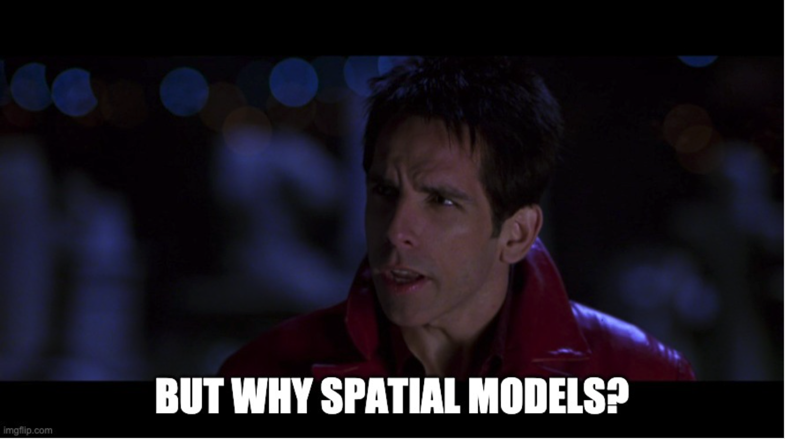

```{r setup, include=FALSE}
knitr::opts_chunk$set(echo = FALSE,
                      fig.width = 14,
                      fig.height = 8)
library(tidyverse)
library(tidycensus)
library(tmap)
library(sf)
library(brms)
library(lubridate)
library(stars)
library(spatstat)
library(leafpop)
options(tigris_use_cache = TRUE)
mapview::mapviewOptions(fgb = FALSE)
theme_set(theme_bw() + theme(text=element_text(size=22)))
```

What's a spatial model and how does it differ from a "non-spatial" model? 
In this post I'll give an answer to these questions and more by providing a 
brief introduction to the three most common classes of spatial data structures 
and the models most often used with them. 
While I'll do my best to build these up from the standard linear model 
commonly used across many quantitative disciplines, this post is no 
substitute for the more rigorous presentations offered elsewhere. See 
[@casella2021statistical;@gelman2020regression] or[@fitzmaurice2008longitudinal] 
for a more though introduction to regression models and 
[@banerjee2003hierarchical;@diggle2006spatio] for a more thorough introduction 
to spatial models.


# The Ordinary Linear Model

One of the very first models introduced in basic statistics curriculum 
is the "ordinary linear model" shown below with three unknown variables: 
$\alpha,\beta$ and $\sigma^2$: 

$$
y_i = \alpha + \beta x_i + \epsilon_i\\
\epsilon_i \stackrel{ind}{\sim} N(0,\sigma^2), \quad i=1,...,n.
$$

<aside>
You may also remember this as $y = mx+b$ from high school. While not *exactly* the same, 
they're both getting at the same idea - a line!
</aside>

This is one of the cornerstone models in applied statistics and for good reason,
a lot of relationships are linear, or at least approximately linear, and it 
offers an interpretable way to understand and test scientific hypotheses 
about reality.


```{r ols,cache = TRUE, fig.cap="Scatter plot with true linear model overlaid.",cache = TRUE}
n <- 20
x <- runif(n)
alpha <- 5
beta <- 2
sigma <- 1
epsilon <- rnorm(n,mean=0,sd=sigma)
y <- alpha + beta*x + epsilon
tibble(y=y,x=x) %>% 
  ggplot(aes(y=y,x=x)) + 
  geom_point() + 
  geom_abline(intercept = alpha,slope = beta) 
```

Ordinary linear models are great, I love and use them all the time. However,
there is a key assumption when writing that cute little "ind" in  the
$\epsilon \stackrel{ind}{\sim} N(0,\sigma^2)$ that can cause us all sorts of 
problems.

## Assuming Independence

By writing those three little letters on top of that little squiggly line,
we're making a *strong* assumption about how we think those data are 
generated. In effect, we're saying that each $y_i$ does not in anyway depend on 
any other $y_i'$, or more formally for any $i\neq i'$, $P(y_i|y_{i'}) = P(y_i)$:
the probability of $y_i$ being equal to some value is the same whether we 
observe $y_{i'}$ or not!

As you can imagine, this is often not the case! In the context of the built 
environment especially, where we may be concerned with estimating the 
rate of crime, traffic, human health outcomes, economic productivity, etc.,
we'd often expect to find that the measurements in one area are very similar
to the rates in an adjacent area. This idea is so well established, that in
the field of geography it has been given high status as a "law".


>"everything is related to everything else, but near 
> things are more related than distant things." - Waldo Tobler's First 
> Law of Geography

Still, even after all this exposition, you may find yourself asking a 
particularly titular question.

```{r copyrightmeme}
## below meme covered by copyright fair use doctrine

```

#  Spatial Models

Spatial models, as well as many other classes of models, remove the
independence assumption by assuming some structural form of dependence 
between observations. Accounting for this is not only crucial to 
conducting valid inference --- our ability to credibly identify the effect 
of some exposure or intervention of interest --- it also helps us predict 
measures in areas where we might not otherwise be able to collect data. The 
manner in which this dependence or correlation between observations is formed 
depends on both the system under study as well as the data collected. 

## Spatial Surfaces

Air pollution, tree cover and carbon dioxide levels. Each of these represent 
a kind of continuous surface across space that one may be interested in modeling 
but would likely need to account for spatial dependency in so doing. 
A common method for modeling this class of data is the Gaussian Process (GP), 
used as a random spatial effect, analogous to a typical random effect, as 
described in [@fitzmaurice2008longitudinal], but now explicitly modeling 
the spatial dependence, or covariance between two observations, $\Sigma_{i,i'}$, 
through a covariance function 
$\Sigma_{i,i'} = \kappa(\mathbf{s}_{i},\mathbf{s}_{i'})$, where $\mathbf{s}_{i},
\mathbf{s}_{i'}$ represent two different spatial locations:

$$
y_i = \alpha + \beta x_i + b_i + \epsilon_i \\ 
\mathbf{b} \sim MVN_n(\mathbf{0},\Sigma) \\ 
\epsilon_i \sim N(0,\sigma^2),
$$
<aside>
one common $\kappa(\cdot,\cdot)$ is:
$\kappa(\cdot,\cdot|\alpha,\rho) = \alpha\exp\{ \frac{ \mid \mid \mathbf{s}_{i} - \mathbf{s}_{i'} \mid \mid^2}{\rho} \}$.
</aside>
For example, suppose we look at the EPA's ozone measurements over 
Allegheny county for the month of August, 2021, shown in 
Figure \@ref(fig:ozonevis1).


```{r ozonevis1, fig.cap="Visualization of average ozone air quality data across Pittsburgh monitors during August 2021. Data taken from the [epa](https://www.epa.gov/outdoor-air-quality-data/)"}

## data taken from 
# https://www.epa.gov/outdoor-air-quality-data/download-daily-data
ozone <- read_csv("~/Documents/CityData/Burgh/AirPollution/ad_viz_plotval_data.csv") %>% 
  st_as_sf(coords = c("SITE_LONGITUDE","SITE_LATITUDE")) %>% 
  st_set_crs(4326) %>% 
  rename(ozone = `Daily Max 8-hour Ozone Concentration`) %>% 
  mutate(Date = mdy(Date)) %>% 
  filter(month(Date) == 8) %>% 
  group_by(`Site ID`) %>% 
  summarise(ozone = mean(ozone)) %>% 
  ungroup() %>% 
  select(ozone)  

mv <- mapview::mapview(ozone,col.regions = heat.colors(3,rev = TRUE))
mv@map
```


```{r gpfit,cache = TRUE,echo = F, message = FALSE, warning = FALSE, include = F}
df <- read_csv("~/Documents/CityData/Burgh/AirPollution/ad_viz_plotval_data.csv") %>%  
  rename(ozone = `Daily Max 8-hour Ozone Concentration`) %>% 
  mutate(Date = mdy(Date),
         Day = factor(wday(Date))) %>% 
  filter(month(Date) == 8) %>% 
  group_by(`Site ID`,SITE_LATITUDE,SITE_LONGITUDE,Day) %>% 
  summarise(ozone = mean(ozone)) %>% 
  ungroup()

gpfit <- brm(ozone ~ Day + gp(SITE_LATITUDE,SITE_LONGITUDE), 
             data = df, 
             cores = 4)
```

Even though we only observe specific points, we understand that the ozone 
levels could be continuously observed across the entire county. Fitting 
a GP model allows us to estimate that underlying spatial dependence and use 
the few points we observed to interpolate across the wider space. 

Looking at Figure \@ref(fig:ozonevis2), you can see this point illustrated.
While we only had a small number of points available, we can now see the 
estimated surface across all the neighborhoods of Pittsburgh.

```{r ozonevis2,cache = TRUE,fig.cap = "Estimated Ozone Surface across PGH using Neighborhood Centroids as prediction points for each Neighborhood's surface."}

# https://data.wprdc.org/dataset/neighborhoods2
pgh <- read_sf("~/Documents/CityData/Burgh/Neighborhoods/Neighborhoods_.shp") %>% 
  st_transform(4326)

cntroids <- pgh %>% dplyr::select(hood) %>% st_centroid()

smples <-  cntroids %>% 
  as_tibble() %>% 
  mutate(hood = pgh%>% dplyr::select(hood) %>% pull(hood),
         SITE_LONGITUDE = map_dbl(geometry,function(x) x[1]),
         SITE_LATITUDE = map_dbl(geometry,function(x) x[2])) %>% 
  mutate(Day = 1) %>% 
  dplyr::select(-geometry)

estimates <- predict(gpfit,newdata = smples)[,1]
pltdf <- smples %>% 
  inner_join(pgh %>% dplyr::select(hood)) %>%
  mutate(ozone = estimates) %>% 
  st_as_sf()


rst <- st_rasterize(pltdf %>% dplyr::select(ozone))

tmap_mode("plot")
tm_shape(pgh) + 
  tm_fill() + 
  tm_shape(rst) + 
  tm_raster()  + 
  tm_layout(legend.position = c("right","top"))
```

## Areal Spatial Networks

In contrast to points that we know are surfaces, we can also observe measures 
at an areal level, census tracts, neighborhoods, city streets, etc.  where 
the spatial correlation isn't understood in terms of the distance between two
points, but rather the adjacency of the two observed units in space. 

For example, in Figure \@ref(fig:arealvis), we can see the median income 
across the different census tracts of Allegheny county. Each tract is adjacent
to several others. In modeling the median income across space, we might 
expect those tracts adjacent to one another to have similar median incomes.


```{r arealvis, cache = TRUE, fig.cap = "Distribution of Median Income Across Allegheny County, PA Census Tracts."}
## American Community Survey
pgh_wealth <- get_acs(state = "PA", 
               county = "Allegheny",
               geography = "tract",
               variables = "B19013_001", 
               geometry = TRUE) %>% 
  mutate(lwealth=log(estimate)) %>% 
  filter(!is.na(lwealth))

A <- st_touches(pgh_wealth ,sparse = FALSE)*1
rownames(A) <- pgh_wealth$GEOID

pgh_wealth %>% 
  rename(`Median Income` = estimate) %>% 
  ggplot(aes(fill=`Median Income`)) + 
  geom_sf() + 
  theme_void() + 
  theme(text = element_text(size=22)) + 
  scale_fill_viridis_c(labels = scales::dollar) + 
  labs(caption = "Data sourced from the 2015-2019 American Community Survey.")
```


One way we can try to capture this notion of network dependency is through the 
Conditional Autoregressive, or CAR model shown below:

$$
y_i = \alpha + \beta x_i + b_i + \epsilon_i \\ 
\mathbf{b} \sim MVN_n(\mathbf{0},\Sigma) \\ 
\Sigma = \tau D(I-\alpha \mathbf{A})
$$
Where before the correlation between two points, $\Sigma_{i,i'}$, 
was a function of the distance between those points, now it is a function 
of the adjacency matrix $\mathbf{A}$ which has a 1 in row $i$ and column $j$
if the $i$th and $j$th observation are connected and is 0 otherwise.

Similar to how we could use the $\kappa(\cdot,\cdot)$ function in the GP 
to learn the correlation of observations across space, the CAR model uses 
the adjacency matrix and associated parameters to learn the how measures 
may be spatially correlated across the spatial network of observations.


```{r carfit, cache = TRUE, include=F}
## Just included for those looking at the code, not actually used.
carfit <- brm(lwealth ~ 1 + car(A, gr = GEOID,type = 'esicar'),
              data = pgh_wealth %>% st_drop_geometry(),
              data2 = list(A = A),
              iter = 5E3,
              cores = 4)
```


## Spatial Point Processes

Last, but certainly not least, we have  spatial point processes. While you 
may be thinking, "Wait, didn't we already talk about points?", you'd be 
half right. In discussing spatial surfaces we observe points, but 
we **model** the points as a continuous surface. Spatial Point processes 
are not only observed as points, they are also modeled as points.

Consider the locations of your favorite nearby fast food restaurants (FFRs). 
These can be plotted as points, as in Figure \@ref(fig:sppp), and modeled as 
realizations from a **point process**.

```{r sppp, cache = TRUE, fig.cap = "Fast Food Restaurants (FFRs) and Schools across Los Angeles."}
bdf <- rbenvo::create_CA_benvo()
pltdf <- bdf$subject_data %>% transmute(Class = "School") %>% 
  rbind(.,bdf$bef_data$bef_FFR %>% transmute(Class = "FFR"))
mv <- mapview::mapview(pltdf,layer.name="")
mv@map
```

Questions surrounding point processes may once again involve examining 
how the points are spatially correlated across space, identifying which points 
in space are most likely to produce the *points* of interest, or even 
simply using the points as data to condition on in some other model of interest.

For example, in the FFR example above, we may be interested in how the 
FFRs are distributed across space from the schools. In this setting one 
could model the distances of the FFRs from the schools as 
arising from an Inhomogeneous Poisson Process, estimating the spatial 
intensity function $\Lambda(d)$ of how likely a FFR is to be located at 
distance $d$ from a school.

$$
\{d\}_{i=1}^{n}|\Lambda(d) \sim \text{IPP}(\Lambda(d))
$$

# Conclusion

This has been a whirlwind tour of spatial models that I hope has given a taste
of what spatial models look like and how they can be used. These models 
will likely come up again and again throughout the course of this blog, as 
so many objects in the built environment are studied across space (and time) 
and so it is worth understanding early-on, if only conceptually, before 
they start to pop up in an applied analysis.


## Acknowledgements {.appendix}

Thanks to Kevin Putschko for reading and offering comments on this article.