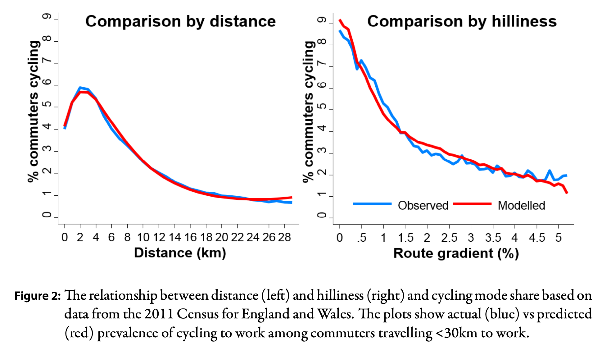
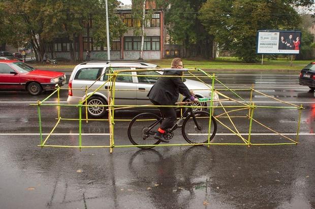

```{r setup, include=FALSE}
#library(tidycensus)
library(tidyverse)
library(sf)
library(gt)
library(osrm)
knitr::opts_chunk$set(echo = FALSE)
```

>  Similar to the Cleanup vs. Crime case study, this post is the first in a series of several that examine the role of transit in the built environment and how many cities are transitioning from car-centric infrastructure to a more multi-modal model.

Bike lanes, climbing lanes and [sharrows](https://en.wikipedia.org/wiki/Shared_lane_marking), oh my! The rise of commuting by bike has risen dramatically over the past two decades as everything from climate change and traffic jams to rising gas prices have sent cities
looking for sustainable, efficient and cheap ways to let their residents travel (See Figure \@ref(fig:commute)). 
In fact, some cities are even trying to go "car free"[@nieuwenhuijsen2016car] – 
setting aside entire sections of the city where only pedestrians and cyclists
can travel (exceptions are made for supply, maintenance and emergency service
vehicles).

But why bikes? They may have been fun to ride around with 
your friends when you were growing up, but do they really offer a viable 
alternative to the crown jewel of american transit - the automobile? 
This post will look at how biking, walking and public transit compare to a car as a primary mode of transportation and highlight the cost, time and safety that using each entails.

```{r commute,fig.cap="Commuting Statistics as shown in the NYC 2018 bike plan."}
knitr::include_graphics("bikecommute.png")
```

# Environments $\rightarrow$ Cost Time and Safety

Everyday people need to go places—work, grocery stores, medical offices, and so on.
^[ Okay, maybe [not as much as they used to](https://www.google.com/url?q=https://www.census.gov/library/stories/2021/03/working-from-home-during-the-pandemic.html&sa=D&source=docs&ust=1645397830021676&usg=AOvVaw1jIpQT0RqRFVIIa66clYiH).] Before someone chooses how to go from A to B, the environment they live in will play a large role in 
determining their choice. How far will they have to travel? What routes and modes 
of transit available? What’s the likelihood of traffic? In answering these questions, some environments will be more amenable to certain types of transit than others. 

The choices in zoning, street planning and more that define where residents can live, businesses be built and the kinds of routes between them, will lay the foundation for how residents move about their environments as a function of a trip’s (1) cost, (2) time and (3) safety/comfort [@ben1985discrete;@transitwikibook]. This post isn’t discussing land use and zoning however. As important as those concepts are, we’ll consider them separately. For now, we’ll think of the environment, or trip distance, as “fixed”^[a statistical/mathematical term, meaning that we’re not interested in exploring how this variable contributes to the relationship of interest] and focus only on the relative strengths and weaknesses, as enumerated above, for each mode of transit in a typical **urban** environment.


```{r,eval = FALSE}
pa_pums <- get_pums(
  variables = c("PUMA", "JWMNP", "JWTR", "COW", "ESR","JWTRNS"),
  state = "PA",
  survey = "acs5",
  year = 2018,
  rep_weights = "both"
  )
```

##  Cost

What follows may seem like common sense. However, sometimes 
even common sense bears repeating. If we were to consider the four modes of transit 
that are most popular—walking, biking, driving in a personal car
and taking public transit —we could broadly consider the cost of each to be something like what we see in the table below.

```{r}
tibble(Mode = c("Walking","Biking","Public Transit","Driving"),
       Cost = c("Free", "Cheap", "Affordable", "Expensive")) %>% 
  gt()
```

Walking is free of course, a typical commuting bike 
(not those fancy carbon fiber bikes) costs a few hundred dollars, 
public transit fares are explicitly designed to be affordable, and 
driving, well, driving costs a bit. 

The upfront cost is usually in the 
thousands of (U.S.) dollars for a used car, and typically in the 
tens of thousands for a new car. Furthermore, most states in the U.S. will 
require individuals to regularly register their car, as well as have it 
inspected and insured. On top of *that*, most car manufacturers recommend 
car owners maintenance their vehicle twice a year or every 20,000 miles,
whichever comes first. The cost of gas, which one might buy more or less of 
depending on the kind of car they have and how 
many miles they drive, tends to vary substantially depending on what 
state/country one lives in and what global economic forces are in play at the 
time. We haven't even gotten to depreciation yet and there are still
*even more* costs. By taking up space for parking, dependency on 
cars can increase the rate of housing [@shoup2021high]. And finally, cars' use of fossil fuels contributes to global warming and also plays a role in air pollution [@johansson2017impacts]. 

<aside>
You can find out more 
about cost depreciation associated with car purchases in this pbs 
educational
[video](https://www.youtube.com/watch?v=TtJXl6pk0Z4&ab_channel=TwoCents).
</aside>

With all the money a car requires, it seems an obvious question to ask why it is the dominant mode of transit in much of the modern world, and especially in the U.S.? Well to really do justice
to that question and answer it in all its worth would take more time than this 
post can afford. We'll explore some of the advantages a car has even with 
all its expense in the sections that follow, but with this starting cost,
it shouldn't be hard to see why so many cities’ mayors turning to bikes and being 
[rewarded](https://www.theguardian.com/environment/bike-blog/2021/oct/29/the-bikelash-paradox-how-cycle-lanes-enrage-some-but-win-votes) for doing so.


## Time 

Given the high cost of car ownership, surely the car owner 
can rest easy knowing they're opting for a more efficient and safer mode of transit, right? It depends. 

While it is undeniably true that the longer the distance, the more favorable 
the car becomes as a mode of transit (see Figure \@ref(fig:ptc) from 
[@lovelace2017propensity]), this isn't usually the type of trip most 
often [made](https://inrix.com/learn/micromobility-study-2019/) day-to-day in urban (or even some suburban) environments. 

```{r ptc,fig.align='center',fig.width=14,fig.height=12,fig.cap="Figure from [@lovelace2017propensity] -see original caption in figure."}
## this figure is taken from the cited lovelace paper which is 
## available under the journal's open access policy

```


For trips such as these, car trips will take much longer, because their 
drivers will have to wait in traffic and, again, depending on the environment, 
look/pay for parking. In contrast, a bike rider will typically not have to 
wait for any traffic^[This may depend on the presence of bike lanes,
the bike riders comfort with passing cars, etc.] and almost never have to pay 
or wait for parking.

One key factor may be confounding our argument here. Cars have to 
wait in traffic because there are so many cars, whereas bikes don't because 
there aren't a proportional number of cyclists, right? Well, 
even if there *were* more cyclists, it's not likely they'd have to wait too 
long in traffic. This is simply because of the efficiency in space that a bike 
has compared to a vehicle. Where a bike takes up $\approx$ 5 feet lengthwise, and 
a "human-size" width (maybe a foot or two), a typical sedan will be about 14 
feet long and 5 feet wide^[taken from nadaguides.com].  If we compare area
footprints, that implies that a car takes up 7 times more space than a cyclist. 
This huge efficiency will mean a lot more cyclists can be put on the road than
cars and still achieve a level of decent transit throughput.

<aside>
This space efficiency carries through to parking as well which is the 
source of many woes in urban development. These arguments can be 
defined more precisely using arguments from calculus, considering the 
Change in area used / unit time of cars vs. bikes but I have opted for 
More, hopefully intuitive, arguments here.
</aside>

```{r bikesize, fig.align='center',fig.cap="Car-bike size comparison. Photo from http://vk.com/letsbikeit"}

```

## Safety

While this is the last topic, it is by far the most important! No one
would get in a car if they thought there were good odds of the trip ending 
in disaster. And yet, automobile accident fatalities continue to number in the tens of 
thousands each year, with countless more causing injury and property damage
[@nhtsa]. Why is this? The simple (physics) fact is that cars have a lot of mass and 
when they hit something while moving at a decent speed, an appreciable amount of deceleration occurs. Consulting our good old friend, 
Sir Isaac Newton's second law, we can recall that:

$$
\text{Force} = \text{Mass} \times \text{Acceleration}
$$

Large mass and large acceleration = large force $\Rightarrow$ higher probability of injuries, death, and property damage upon collision

In contrast, a bike with a human on board has much less mass and since bikes 
rarely go *too* fast, even in the age of e-bikes, there's not as severe a 
deceleration when hitting a stationary object. Consequently, a bike 
collision, *sans* car, does not produce as much force as their automobile 
counterparts. This isn't to say that there can't be meaningful harm as a 
result of bike accidents, or that, in an environment where bikes are a 
predominant form of transit, accidents won't happen. However, the physics are 
certainly more supportive of bike transit producing safer trips --- 
fundamentally --- in comparison to cars.

## Groceries, weather, and kids

Yes, well bikes may have these advantages but what about when you have to haul 
a week's worth of groceries home, take your kids to school, or get to work 
in bad weather? Just as adaptation measures were and are taken to try and
improve the feasibility of cars' weakness --- seat belts, anti-drunk driving
campaigns, and so on --- there are equivalent adaptation measures that are 
taken by those committed to commuting by bike. 
[Cargo bikes](https://www.youtube.com/watch?v=f5pytNeRS7g&ab_channel=GlobalCyclingNetwork), 
especially their electric variants, are one preferred strategy for hauling goods and/or children to and fro, 
though there are also some services offering grocery delivery by bike as well.
Bad weather may be simply overcome by a mixture of proper clothing and 
equipment.

However, bikes are still not and cannot be for everyone. Those who are unable 
to ride bikes, due to a lack of physical capacity for instance, still need a 
service that can offer them a means of transportation across a city and it 
is for *this* population, that cars or preferably public transit should be offered. 
Yet their potential cost and efficiency advantages are such that a greater investment in bikes and bike infrastructure is well warranted.


# Bikes, Buses and Beyond! 

While this post likely covers a lot of material that may feel like common 
knowledge, I'm hoping to use it as the foundation from which to carry this topic
further. What kind of efforts are being taken in the U.S. and across the globe 
as better support for bike, pedestrian and public transit infrastructure? What 
statistical innovations can we develop to further these causes? More on these
ideas in the posts to follow!
