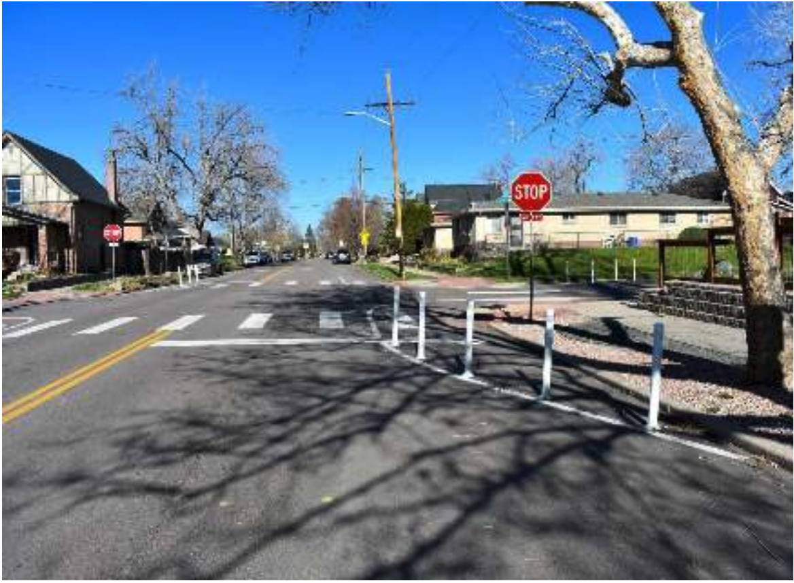

```{r setup, include=FALSE}
knitr::opts_chunk$set(echo = FALSE)
```

```{r libraries}
library(tidyverse)
library(sf)
library(lubridate)
mapview::mapviewOptions(fgb = FALSE)
```

I recently had the great joy of participating in the civil engagement process 
at the Shadyside Connector virtual meeting hosted by the City of Pittsburgh's
[Department of Mobility and Infrastructure](https://pittsburghpa.gov/domi/).
The video of the night's meeting can be found 
[here](https://youtu.be/Svuex_-1nQE) and the slides can be found [here](https://mcusercontent.com/231e8697ed9b0d699b1b55c82/files/2c626c6a-8c49-5727-eb6b-bc016116ddd8/pdfresizer.com_pdf_resize_1_.pdf).

This meeting, and the project that is its focus, captures so many different 
aspects of what the planning process looks like, from the high level concept,
to on the ground data collection, public engagement, comment periods and so on,
that I thought it offered the perfect opportunity to give a "real-world" 
application for many of the statistical ideas that are also discussed on this 
blog. This project is currently ongoing, so there will be more to write about
as time goes on. For now we'll focus on the background leading up to this 
meeting, the proposed changes to the neighborhood's streets and the 
plan for implementing these changes in the years to come.


```{r bikeplan, preview = TRUE,fig.cap="Proposed Bike Network from Pittsburgh's Bike+ Plan. Figure taken from pittsburghpa.gov"}
knitr::include_graphics(path = "https://apps.pittsburghpa.gov/redtail/images/10132_2020-06-16_Pittsburgh_Complete_Streets_Proposed_Bicycle_Network.jpeg")
```

# Overview

This meeting comes amid a larger effort by the city to expand and improve 
the city bike network's^[An all encompassing term, including dedicated bike lanes as 
well as streets without dedicated lanes where cyclists feel safe riding] access 
and safety. The high level overview of this plan is contained in the 
city's [Bike+ Plan](https://pittsburghpa.gov/domi/bikeplan) 
(See Figure \@ref(fig:bikeplan)) which provides a long term vision of how the
city hopes to expand the bike network. This meeting specifically focused on the
"Neighborhood Connector" connecting the East Liberty and Shadyside 
neighborhoods. While several different routes were considered for this 
"Connector", survey results pointed to Ellsworth Avenue as the preferred target 
for improving cycling safety. 

<aside>
The city of Pittsburgh also recently announced a 50 year mobility 
[plan](https://triblive.com/local/pittsburgh-unveils-50-year-mobility-plan-with-hyperloop-gondolas-bike-network/) 
which includes all sorts of eyebrow raising ideas like gondolas, hyperloops, 
and good'ol fashioned bike lanes.
</aside>


```{r shady,fig.cap = "Shadyside neighborhood and Ellsworth Street. Neighborhood highlighted in grey, street in blue. Data from wprdc.org"}
shadyside <- read_sf("~/Documents/CityData/Burgh/Neighborhoods/Neighborhoods_.shp") %>% 
  filter(hood == "Shadyside") %>% 
  transmute(Object = "Shadyside")

ellsworth <- read_sf("~/Documents/CityData/Burgh/alleghenycounty_streetcenterlines202107/AlleghenyCounty_StreetCenterlines202107.shp") %>% 
  filter(str_detect(ST_NAME,"ELLSWORTH")) %>% 
  st_filter(shadyside) %>% 
  st_union() %>% 
  st_as_sf() %>% 
  rename(geometry = x) %>% 
  transmute(Object = "Ellsworth")
  

mp <- mapview::mapview(list(shadyside,ellsworth),
                 layer.name = c("Shadyside","Ellsworth"), 
                 col.regions = c("grey","blue"))
mp@map
```

# Goals and Plan

The goals for the connector plan are as follows (taken from their slides):

* Improve bike mobility and comfort
    * Car Speeds < 25mph
    * Vehicle Volumes < 3000 
* Improves pedestrian comfort 
    * Crossing Improvements 
* Supports and enhances transit access and comfort
    * Prioritizes pedestrian movements 
    * Supports transit movements
* Reduces amount and severity of crashes
   * Increases safety for all users including motorists
   * Maintains vehicular access and parking
   
While these goals aren't quite as quantitative as a statistician would 
like, they still speak to values many members of the community share --- 
an important feature in all political discussions.


```{r trafficcrashes,fig.cap="Traffic and accidents on Ellsworth Ave. Traffic counts from 2021, injuries from 2018-2019. Posted speed limit on this street is 25 miles per hour."}
tfdf <- read_csv("~/Documents/CityData/Burgh/Traffic Count/traffic_count.csv") %>% 
  filter(neighborhood == "Shadyside",) %>% 
  st_as_sf(.,coords = c("longitude", "latitude")) %>% 
  st_set_crs(4326) %>% 
  st_transform(st_crs(ellsworth)) %>% 
  st_filter(ellsworth,.predicate = st_is_within_distance,dist = 200) %>% 
  mutate(count_start_date = ymd(count_start_date)) %>% 
  filter(year(count_start_date) == 2021) %>% 
  rename_all(function(x) str_to_title(str_replace_all(x,"_"," ")))


## Need to fix lat/long format
crashes <- read_csv("~/Documents/CityData/Burgh/Crash Data/alleghenycrashdata.csv") %>%
  filter(CRASH_YEAR >= 2018,str_detect(STREET_NAME,"ELLSWORTH")) %>% 
  select(INJURY_COUNT,contains("TUDE")) %>% 
  rename(Injuries = INJURY_COUNT)

mp <- mapview::mapview(ellsworth,legend.display = FALSE) + 
  mapview::mapview(tfdf,zcol = c("Average Daily Car Traffic","Max Speed")) 
mp@map
```

The proposed "treatments"^[A term I love for framing traffic, accidents, etc. 
as public health ills.] consist of a number of street shape alterations ranging
from "rounding out" the corners at stop signs (See Figure \@ref(fig:tx)), adding "chokers" or street 
narrowing concrete planters and roundabouts. The last of these recognize the 
realities of how cars and bikes *actually* use stop signs --- they don't. 
Whether these various treatments are sufficient to reach the goals listed above 
is debatable and several of the [questions](https://youtu.be/Svuex_-1nQE?t=3708) 
aired at the end of the meeting highlighted this point, while still 
appreciating the approach the city's engineering team was taking: flexible at 
the beginning, committing to more long term infrastructure changes after 
initial evaluation. 

```{r tx,fig.cap="Example Treatment used to 'round out' Stop Sign areas. Figure taken meeting slides linked above."}

```

```{r stopsigns,fig.cap="Stop sign locations along Ellsworth.",include = F,eval = F}
stop_signs <- read_csv("~/Documents/CityData/Burgh/Traffic Signs/trafficsign_dataset.csv") %>% 
  filter(!is.na(latitude)) %>% 
  st_as_sf(.,coords = c("longitude","latitude")) %>% 
  st_set_crs(4326) %>% 
  st_transform(st_crs(shadyside)) %>% 
  st_filter(shadyside) %>% 
  filter(str_detect(description,"Stop"),
         str_detect(street,"Ellsworth"))

mp <- mapview::mapview(list(shadyside,ellsworth,stop_signs),
                 layer.name = c("Shadyside","Ellsworth","Stop Signs"),
                 col.regions = c("grey","black","red"))

mp@map
```


# What Lies Ahead?

I enjoyed this meeting and plan to return to this topic again in the weeks and 
months to come, both to provide a perspective in evaluating the proposed 
treatments --- pending data access --- and to discuss the various social 
and political dynamics that undercut these meetings. 

While I'm very happy to say that the meeting was conducted in a friendly and 
civil manner, due in no small part to the professionalism of the Dept. of 
Mobility and Infrastructure, MoveForward, and BikePGH staff, there were several
issues that predominate here and across the U.S. that raised their heads at this 
meeting, warning of potential conflict to come. These included (1) The issue of
parking and whether more or less space should be given to parking, (2) how 
space for cyclists should be prioritized relative to cars, and (3) the rate of 
progress in developing these, largely bike-friendly plans, relative to 
car street development. Many of these spoke to a generational gap --- I 
recall hearing [frustration](https://youtu.be/Svuex_-1nQE?t=5112) on the part 
of the younger people on the call that the 
[progress](https://youtu.be/Svuex_-1nQE?t=3818) of bike friendly 
infrastructure wasn't happening quickly enough and concern on the part of 
older individuals at to [what exactly](https://youtu.be/Svuex_-1nQE?t=4474) 
might happen and how it might affect 
[their parking](https://youtu.be/Svuex_-1nQE?t=3772). Though I also think it is 
fair to say that even amidst their concern or impatience, everyone was 
generally very supportive.

Whether young or old, **everyone** deserves to use streets safely and I am 
excited to see how the community works together as this project progresses.


# Disclaimer

I live near Shadyside and bike in this neighborhood and on Ellsworth regularly. 
While I'd like to think I can still offer a dispassionate view of this topic, 
I would be remiss if I didn't mention this very important point to you, 
dear reader, so that you might judge my opinions accordingly.

## Acknowledgements  {.appendix}

Thanks to [Robert Svoboda](https://www.linkedin.com/in/rcsvoboda/) for reading 
and offering comments on this article.