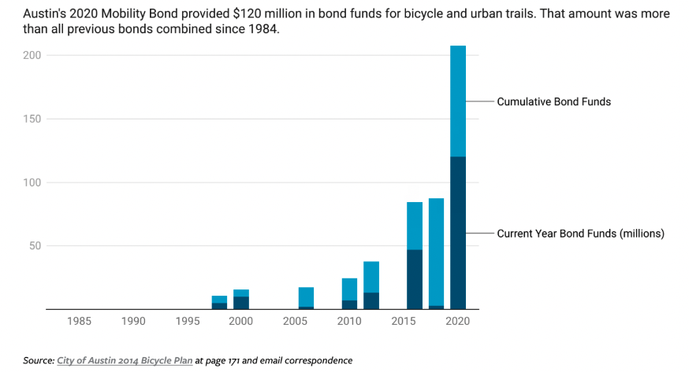
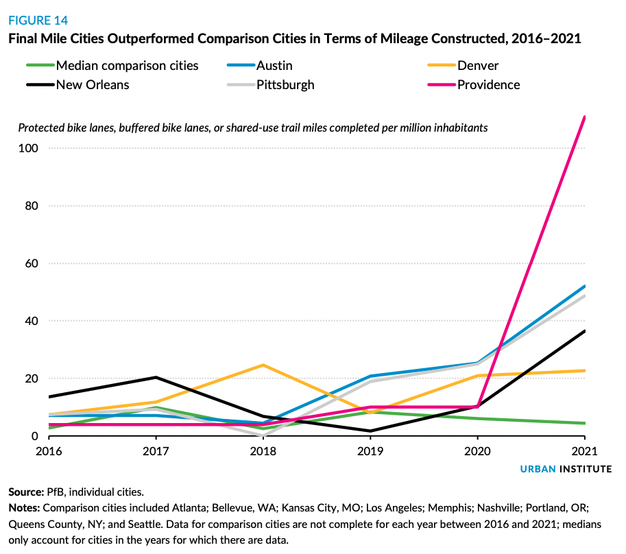
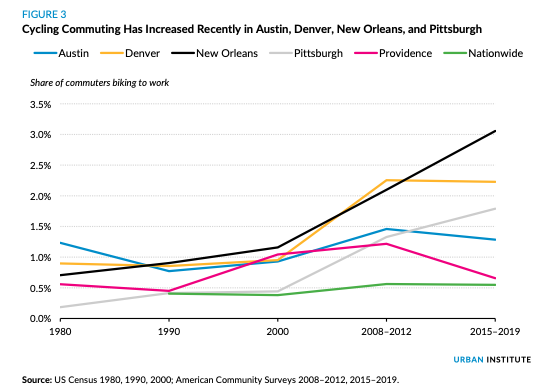

```{r setup, include=FALSE}
knitr::opts_chunk$set(echo = FALSE)
```

In the previous [post](xstreetvalidated.com/posts/2021-10-09-bikes/) we examined
why, fundamentally, bikes and multi-modal transit have several advantages over 
cars in urban spaces with regards to traffic, economic cost, safety and more. 

With this understanding, we turn our attention to the dramatic changes several 
cities are making in order to exploit these advantages and provide their 
citizens with all the benefits a less auto-centric city design can offer. 
We'll start with the dramatic sweeping changes in Europe and work our way to 
the more moderate progress in the U.S. 

Before we dive deeper into things, a quick word on references. This post draws 
from material produced by the 
["City Beautiful"](https://youtu.be/g9-9CxCxrVE) and 
["Not Just Bikes"](https://youtu.be/sI-1YNAmWlk) youtube channels. I highly 
encourage you to check out their material as I've enjoyed learning from it.

## Europe 

### Oslo, Norway

In 2017 city leaders in Oslo, Norway announced they would block off 
large swaths of the city to private passenger vehicles[@youtubecb]. 
Such demonstrative actions are rarely easy, even in a nation as committed to 
its environmental character as Norway --- the country plans to be carbon 
neutral by 2030. In this case, both members of the public and business leaders
needed convincing [@wolfe_2018]. Thankfully, it would appear at least so far 
that their change of heart has been rewarded --- not only has pedestrian traffic
increased in the commercial districts but Oslo was also the only major 
city to report no pedestrian or cycling deaths during 2019 [@peters_2019;@youtubecb]^[Note that these sources are reporting time periods prior to the global Covid-19 pandemic.]
. Current research examining how mobility patterns have changed since these 
measures were put in place show that in some neighborhoods, cars are used for 
only 1/6 trips and that those who do still drive do so mainly for job
or health related reasons[@odot]

```{r, fig.cap="Oslo, Norway. Photo by Bahnfrend - Own work, CC BY-SA 4.0, https://commons.wikimedia.org/w/index.php?curid=89736202"}
knitr::include_graphics("oslo.jpg")
```

While Oslo is clearly ahead of the game, other cities in Europe have also made 
similar efforts: London, Hamburg, Madrid, [Milan](https://www.bloomberg.com/news/articles/2022-01-14/milan-plans-bike-lane-infrastructure-to-rival-paris) and Paris have each renewed efforts 
to prioritize cycling and pedestrian over cars in city centers 
[@wolfe_2018;@youtubenjb;@youtubecb;@nieuwenhuijsen2016car]. 
Perhaps, the city most eager to try and overtake Oslo is Paris, whose city government set 
the ambitious goal of becoming 100% cyclable by 2026.

### Paris, France

In 2016, Mayor Anne Hidalgo oversaw the beginnings of a program called 
“Paris Respire” or Paris Breathes, which introduced various measures including 
banning cars from certain areas of Paris on the first Sunday of the month and 
making public transport and city bicycles free for the day. After the Covid 19 
pandemic took off, Mayor Hidalgo’s administration expanded bicycle lanes and 
has since made even further plans to reduce the number of parking spaces in 
the city, even going so far as to revamp the famous Champs-Elysees into a more 
pedestrian and cycle friendly space
[@reid_2020; @willsher_2021]. 

If that seems like a lot of change in a short amount of time, you’d be right. Such 
rapid change is not without growing pains and [@youtubenjb] documents several
issues with the transition, ranging from unclear and inconsistent signage, to infrastructure changes that are less than well thought out. It should be emphasized, however, that this is undoubtedly the right direction to move a city in. In fact, by moving so quickly,
Paris has given other cities across the world the opportunity to learn from 
their mistakes. As we turn our attention to the auto-centric U.S. such lessons 
will be of the utmost importance, in convincing U.S. drivers to turn off their 
cars and swing their legs over their bike seats or take a walk.

## USA

In the United States, our ability to move towards car-free spaces
has been slower. Where European cities have the advantages of several 
centuries of infrastructure centered around humans walking to which 
bikes easily adapt, much of the U.S. was built after the advent of the 
automobile. This led to development patterns that centered around the automobile
as the primary mode of transit. Still, there are many cities where substantial 
progress has been made investing in cycling infrastructure, weakening
the dependency on cars and the need for car-dominant spaces. This progress has 
accelerated as the Covid-19 pandemic fundamentally alters the American 
relationship with the work office.  While there are many cities 
doing exciting work, we’ll focus on two cities: Austin, TX and Pittsburgh PA, 
who have both been 
[investing](https://www.urban.org/urban-wire/how-can-cities-rapidly-expand-access-cycling-infrastructure) 
above and beyond other US cities. 

### Austin, TX

Whether gaining notoriety as a liberal enclave in a very red state or growing 
economically as the city continues to expand its residential footprint, Austin,
TX has gained a lot of attention over the past several years.  Publishing several
bike plans throughout the past 20 years, the city has made a goal of increasing
the share of people walking, biking or taking public transit to work to 50% in
2039. Passing two ballot measures since 2016 has shown Austin is putting its
money where it’s mouth is—building real momentum to make cycling a much safer
reality [@benchmarking_bike_networks_2022].

```{r}

```


Further progress in the city has arrived thanks to Austin's frequent repaving
schedule, and their response to COVID-19. By repaving their roads every 
ten years, as opposed to every twenty like in many states, Austin has been able 
to bring bike infrastructure to the city faster. Furthermore, in response to 
the pandemic, Austin installed a protected intersection on Congress Avenue, 
one of Austin's most iconic streets that serves an important role in connecting
Austin's downtown to its river walk and other amenities. Even further progress 
is hoped for with a comprehensive plan re-imagining land use in Austin through 
the [CodeNEXT](https://www.austintexas.gov/department/codenext) plan. 
However, these ideas are still considered contentious and the plan is 
currently being held up by a 
[lawsuit](https://www.kvue.com/article/news/local/austin-land-development-code-codenext-appeals-court/269-3a8e70ae-5848-45e3-bf82-e3fe12bc61bb).

Still, whether more fundamental change arrives sooner or later, Austin has 
made great strides in providing safer streets for it's cyclists.

### Pittsburgh, PA

Turning our attention north, to the old steel city of Pittsburgh, we find more 
good news. As one of five cities participating in the “Final Mile” program 
(along with Austin), Pittsburgh has committed to investing $22 million to 
support bike investments. The proposed investments aim to construct 60 miles 
of new or upgraded bikeways, half of which would be protected – an extremely 
important feature for attracting current and new bike riders. 

```{r}

```

This investment brings Pittsburgh that much closer to it’s Bike+ goal of 123 
miles of new on-street bike facilities^[bike facilities is the catch-all 
term that refers to all infrastructure aimed at making bicycling more 
accessible. See [here](https://en.wikipedia.org/wiki/Cycling_infrastructure) 
for more information.] by 2030 and it’s number one goal of reducing the 
number of traffic accidents and fatalities to zero. While this doesn’t put 
Pittsburgh at the front of the pack in terms 
Of new bike infrastructure, it certainly helps the city keep pace as the 
cycling ridership in the grows rapidly.

```{r, fig.width = 14, fig.height = 8}

```

## From Autos to Bikes and Beyond 

As mentioned in [@freemark2022], making these investments and transitions from 
an auto-centric infrastructure to a more multi-modal, bike friendly 
infrastructure is not easy. City governments, citizen advocates and non-profits 
all have to work together to bring about the kind of change that is needed to 
make cycling a safer and realistic form of 
transit across the city. In the next post, we’ll examine research that is 
trying to make this work easier, creating strategies to make it easier to 
identify how and where to best invest in cycling infrastructure.


## Acknowledgements {.appendix}

Thanks to [Paul Haluszczak](https://www.linkedin.com/in/expertly-paul/) and 
[Robert Svoboda](https://www.linkedin.com/in/rcsvoboda/) for reading and 
offering comments on this article.