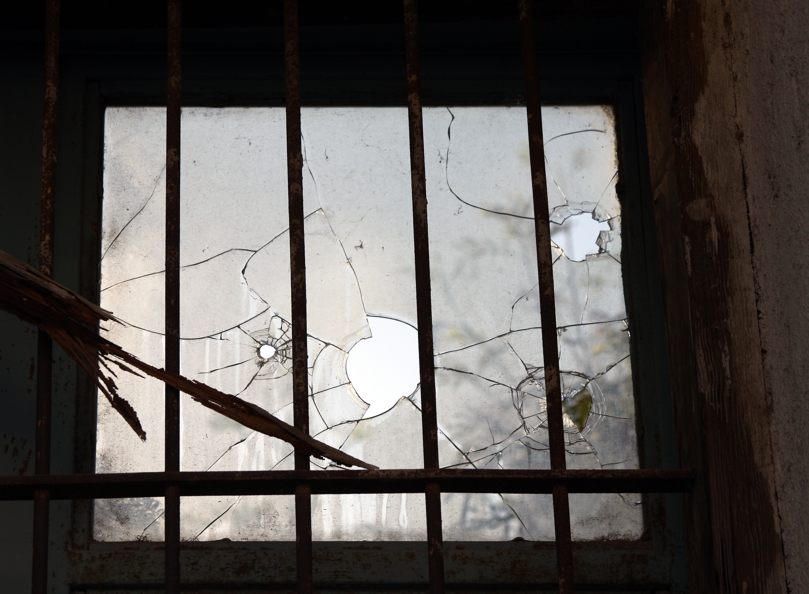

```{r setup, include=FALSE}
knitr::opts_chunk$set(echo = FALSE)
library(tidyverse)
library(lubridate)
theme_set(theme_bw() + theme(text=element_text(size=22)))
```

> The lowest and vilest alleys in London do not present a more dreadful record 
> of sin than does the the smiling and beautiful countryside. - Sherlock Holmes, 
> The Adventures of the Copper Beaches

After all the randomization, cleaning and measuring, now comes the philosophical
pondering. Why did we see the low rates of crime we did in the areas around
the greened lots? This is not a question to which we can provide a definitive 
answer, at least not from this study alone. However, we can discuss 
some of the prevailing ideas in this space and consider which among them 
are most compelling.


# Eyes on the Street


The authors offer a number of summary comments detailing the potential 
mechanisms that may explain the reductions in shootings. The first arose 
from their qualitative research --- survey interviews --- which suggested 
that the greened vacant lots encouraged nearby residents to be more likely to 
leave their houses to walk by or spend leisure time in the lots that were 
previously used for illicit activities like drug dealing [@moyer2019effect].  
The decrease in crime then, under this premise, arose from the increased number 
of residents using the vacant lots as it provided an increased number of 
undesirable witnesses for those who might otherwise become involved in a 
shooting. The author's cite this as a possible manifestation of 
**routine activities theory**, which posts that predatory crime is 
most likely to occur when a motivated offender, a desirable target, and a lack 
of effective guardians converge in time and place [@cohen1979social].


This is a powerful idea, and while the work cited was 
published in 1979, there was an even earlier argument for these ideas in the 
60's. In one of the seminal works of urban planning, "The Death and Life of 
Great American Cities", Jane Jacobs lays out a similar, simple thesis 
for what makes city streets safe [@jacobs1959death]:

> ... [T]here must be eyes upon the street, eyes belonging to those we might 
> call the natural proprietors of the street. The buildings on a street equipped 
> to handle the strangers and to insure the safety of both residents and 
> strangers must be oriented to the street. They cannot turn their backs or 
> blank sides on it and leave it blind.

Personally, I find this idea so compelling because it is so simple. We are 
innately social creatures and care *a lot* about what others think about us.
We simply act differently when we think others may be watching, 
no matter our capacity for ill-intent. Still, there may be more at work here 
then simply increasing the number of eyes on the street.

# Social Cohesion and Broken Windows

```{r,fig.cap="Figure from Tomas Castelazo, CC BY-SA 3.0 <https://creativecommons.org/licenses/by-sa/3.0>, via Wikimedia Commons"}

```

There are two more sociological theories that may be at play here. The authors 
cite both **collective efficacy theory** as well as **broken windows theory** 
as being relevant in their final comments 
[@sampson1997neighborhoods;@kellingwindows1982]. 
The first theory speaks directly to the idea of social cohesion highlighted 
in this blog's introductory 
[motivation](https://xstreetvalidated.com/posts/motivation/): that members of a
neighborhood community will attempt to self-regulate one another, separate of a 
more formal process, in order to avoid problems like those that may arise with the 
police. Additionally, they'll also act to encourage other behaviors that promote
shared values. The authors in our paper argue that the cleaned up vacant lots 
may have promoted this sense of social cohesion, prompting a renewed willingness
to act for the common good and normalizing a higher standard of behavior in the 
community. 

Building off this idea, the broken windows theory posits that 
a sense of disorder may promote further disorder --- if one 
window is broken in a building, the rest will soon be broken. By restoring 
some sense of "order" to the built environment, 
the greened and mowed vacant lots reduced the inherent psychological feeling
that crime was appropriate. It may be worth noting here, briefly, that 
what constitutes a sense of order broadly is not necessarily uniformly 
understood, but for our purposes we'll consider "order" in this context to 
mean the vacant lots without trash or apparent lack of use.

# Which is it?

All of these ideas represent plausible mechanisms by which the 
greening and mowing intervention effects on gun violence may have occurred. 
We can't really know which, or to what extent one theory may have had a larger 
role to play than the others from this analysis but future work 
that target these theories more specifically could. 
For example, one might be able to scrape comments and photos on social media 
sites like Nextdoor or Twitter that mention the vacant lots, and try to 
identify how the attitudes community members communicate about these spaces 
may comport more or less with the theories stated above. For my part, 
I think each of these theories probably plays some role, though I have to think
that the eyes on the street may be the most impactful in discouraging misdeeds.

# Looking Ahead

This post represents the final writing I plan to do on this paper specifically, 
though I hope to reference it again in future work. Specifically, I hope to
build on the ideas discussed here to examine different ways crime manifests 
in cities during times of duress --- like, say a pandemic --- as well as consider 
alternative methods for modeling crime. Regardless, it is my hope that 
having read some or all of this case study, you've come away with an 
appreciation for both the importance of the built environment as it affects one 
of the most important aspects of our lives --- safety --- as well as gained 
some understanding of the difficulties in how we measure and analyze these 
phenomena.


> The pressure of public opinion can do in the town what the law 
> cannot accomplish.
> There is no lane so vile that the scream of a tortured child, or the thud of 
> a drunkard's blow, does not beget sympathy and indignation among the 
> neighbours, and then the whole machinery of justice is ever so close that a 
> word of complaint can set it going, and there is but a step between the 
> crime and the dock. But look at these lonely houses, each in its own fields, 
> filled for the most part with poor ignorant folk who know little of the law. 
> Think of the deeds of hellish cruelty, the hidden wickedness which may go on, 
> year in, year out, in such places, and none the wiser." - Sherlock Holmes,
> The Adventures of the Copper Beaches

## Acknowledgements {.appendix}

Thanks to [Robert Svoboda](https://www.linkedin.com/in/rcsvoboda/) for reading 
and offering comments on this article.