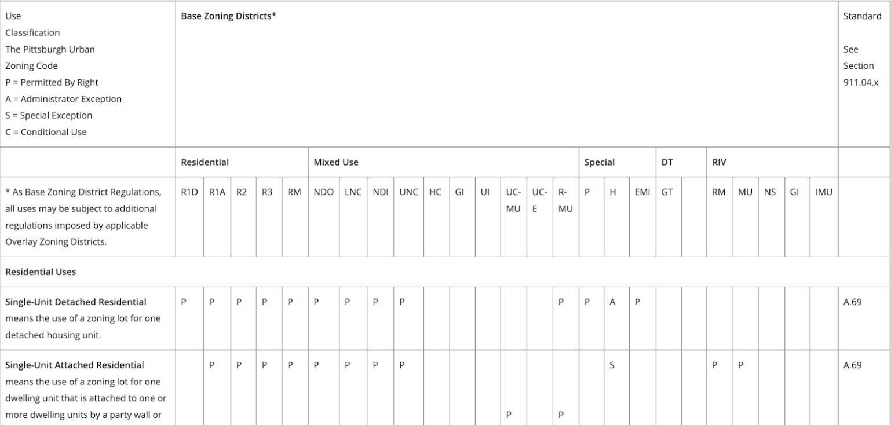

```{r setup, include=FALSE}
knitr::opts_chunk$set(echo = FALSE)
library(tidyverse)
library(sf)
```

> “This was the backbone of zoning: a division of the city into use zones and boxes into which buildings had to fit in order to avoid crowding their neighbors; to avoid creating public health, safety, or fire hazards; and to prevent land use combinations likely to create nuisances in the future.” (p.3 "A Better Way to Zone")

## A Book Review

I’ve decided to take a break from the usual statistics papers that I discuss on
this blog to provide a brief review of a [book](https://g.co/kgs/hYYsWe) I 
recently finished, “A Better Way to Zone: Ten Principles to Create More
Livable Cities” by Donald Elliot. While zoning is not the sexiest of topics,
the influence zoning has on our built environment cannot be overstated. Indeed,
many of the serious societal problems we’re facing in the US today, from
homelessness and housing prices to our dependence on cars, can find some major
root in the local zoning code. 


While I’ve been fascinated with and studied the built environment for years,
this was my first major foray into a text that explicitly touched the zoning
code. As such, I can’t comment on how effectively Elliot offers his readers an
accurate picture of the zoning landscape, but I can say that my general
impression of Elliot’s expertise and his writing was very positive. I came away
feeling much more educated about the history of zoning in the US that led to our
current problems. 


I can’t hope to cover everything Elliot does in his book, but I’m hoping to
provide a brief overview of what zoning is and why it matters, a few key
principles Elliot prescribes for better zoning, as well as touch on why *I*
find this topic so exciting. You can also take a look at my
[notes](https://docs.google.com/document/d/e/2PACX-1vTvus6fjM0nmt1WKOZZCp7Y-x9JNS8-W5w4wBSK-xXyn4pj4KyGbeuz1gyOLfJ1NhwS88V33LIyzjL-/pub), for those interested in reading more.


```{r, fig.cap="Zoning Map of Pittsburgh. Each color corresponds to a different zoning district. Data From [wprdc.org](http://www.wprdc.org/)"}
zones <- read_sf("~/Documents/CityData/Burgh/Zoning/Zoning.shp")
zones %>% 
  ggplot(aes(fill = full_zonin)) +
  geom_sf() + 
  theme_void() + 
  theme(legend.position = 'none') 
```

## Zoning: What it is and What it isn't 

The logic behind zoning as a legal construct is the same as that quoted at the
start - place residences and/or businesses sufficiently apart from one another 
to prevent health and safety issues. Intuitively, this idea makes perfect sense.
Nobody wants to live near a factory billowing smoke, so carving out space on a
city map with one section for houses to be built, another for shops, and still
another for factories seems reasonable.

The [first zoning law](https://en.wikipedia.org/wiki/1916_Zoning_Resolution) 
that put these principles into practice in the US was
written in New York and strongly influenced by the [tenement acts](https://en.wikipedia.org/wiki/New_York_State_Tenement_House_Act), which
established standards for room sizes, sanitation, and ventilation. A natural 
next step from deciding people should have enough room *within* a building is
to decide they should also have enough room *between* buildings, especially 
different types of buildings.

And so, zoning made distinctions between spaces for industrial buildings, 
like factories, and residential or commercial buildings, like houses
and shops. This kind of zoning is called “Euclidean Zoning,” named after a
[court case](https://en.wikipedia.org/wiki/Village_of_Euclid_v._Ambler_Realty_Co)
in Euclid, Ohio. Each zone that’s carved out for a specific *use* is
called a zoning district. However, the notion of a zoning district quickly
became abused. Categories started to proliferate faster than sensible rules
could restrain them:

>“[A] veterinarian wants to open up a clinic in a small-scale neighborhood
business zone but that is not a permitted use. The question has not come up
before, and the city decides that it did not really intend to keep veterinarians
out of neighborhood commercial areas. They are, after all, a neighborhood 
service. The city proposes an amendment to add “veterinarian” as a permitted 
use. The neighbors object and will support the zoning text change only if it is
limited to a 5,000 square-foot facility. “Done” says the city. Now the
ordinance has “veterinarian” and “veterinarian, under 5,000 sq. ft” in the
list of permitted uses. But the following year, when the scenario plays out
again across town, a different set of neighbors insists that there not be any
animals on the premises at night. That eliminates the risk of barking for the
houses across the alley. “Done,” says the city. Now we have “veterinarian, under
5,000 sq. ft. no overnight boarding” in the list. Next, someone wants a
big facility and the neighbors are afraid of the noise and smell of the outdoor
dog run, so “veterinarian, no outdoor enclosures” is added.” (p.44)


Obviously this all seems a bit silly, but as Elliot points out, this is not all
that hypothetical. City council members have a strong incentive to keep city
residents happy, so the urgent need to solve today’s problem often means
overlooking the problems it will create tomorrow.

It is important to note that zoning codes describe a list of permitted uses
today but are not in any way forward-looking. In contrast to this present-minded
state, there is also the concept of a “city plan” (or city planning), which
takes a forward-looking view to think about how specific areas of the city today
might be altered to fit a more unified vision of the city for tomorrow. 

You’d think zoning and city plans might have a lot of overlap, but they tend to
be thought of separately. Elliot attributes this to the two separate and
disjointed publications by the Commerce Department, which introduced each of
these ideas separately without providing any kind of unifying framework. The
lack of cohesion can lead to problems. As one might imagine, it would be worth
having the city plan built into the zoning code itself, so that changes to the
zoning code were consistent with the long term vision of the city. However, 
because these two models of what the city should be were historically maintained
separately, this did not always come to pass.

<aside>
The two publications in question are the Standard Zoning Enabling Act of 1924
and the Standard City Planning Enabling Act. You can learn more about these
acts [here](https://www.planning.org/growingsmart/enablingacts/#:~:text=A%20Standard%20State%20Zoning%20Enabling%20Act%20(SZEA)&text=It%20included%20a%20grant%20of,and%20amending%20the%20zoning%20regulations.)
</aside>

## Present Day Consequences

Much of the book is spent exposing the flaws present in the typical kind of
zoning codes practiced today in an effort to expose a key lesson on how zoning
could be improved moving forward. I’ll limit myself to just a few of these
ideas: Transportation Planning and Predictability vs. Flexibility.


### Transportation Planning

I wanted to make sure to touch on transportation planning, given that it was
the subject of previous 
[posts](https://xstreetvalidated.com/posts/2021-12-19-propensity-to-cycle/)
on the blog. Elliot notes that historically, 
zoning didn’t even consider transportation planning as part of their purview.
A zoning district merely described what was or was not allowed in a certain
space of the city. While this might include certain details that implicitly 
touched on transportation, like a minimum parking requirement, it typically had
no concern for how many cars could come to or from the site in question. 
This quickly became a concern, especially in the era of the automobile.
A new apartment or mixed-use development could include hundreds of apartments 
and several new stores and restaurants leading to potentially hundreds of
new cars on nearby roads. Could the street network handle that increased
volume? Yes? No? Maybe?

As Elliot notes in the book, modeling traffic is not a straightforward exercise
and, as I’ll invite you to imagine, involves any myriad number of assumptions
about which mode of transit different residents or store customers will use,
how often they’ll use it, etc.  

Still, as Elliot notes, it *is* worth considering transportation planning and 
zoning hand-in-hand. It likely does not make sense to zone a parcel of land near
a one lane road for a mixed-use high density development like previously
mentioned if it is understood that most residents will be car-dependent in the
city. Zoning and transportation planning go hand-in-hand and current and future
planners and city council members would do well to consider the interplay
between the two.

### Predictability vs. Flexibility

Elliot repeatedly discusses the theme and balance of predictability vs.
flexibility throughout his book. We’ve already hit on this idea with Elliot’s
veterinarian example. Euclidean zoning implicitly strives to be predictable
within each zoning district. Setting a zone district on the basis of uses
signals to both the developer and the consumer that there will be at least some
level of uniform expectation within that zone - whether it be the type of
building built there, the setback off the street, or the maximum height of the
building. You can see this in the 
[Pittsburgh zoning code](https://pittsburghpa.gov/dcp/zoning) for example 
(Figure \@ref(fig:zonecode)).

```{r zonecode, fig.cap="Screenshot of one part ofPittsburgh Zoning code. Sourced from https://pittsburghpa.gov/dcp/zoning."}

```

In the above table, each base zoning district – Residential, Mixed Use, etc.
– has different Residential uses that are “Permitted by Right”, denoted by a P
in the table, meaning that there are no additional requests that need to be made
to the zoning board in order to build. Alternatively, some may require an
“Administrator exception” – meaning that a staff member of the city may have to
use their judgment on whether or not the use is permitted, and so on. The
general theme here being that one can typically expect to see the types of uses
that are “Permitted by Right” in their respective zoning districts and so have
some measure of what to expect when they invest or purchase a property there. 
Still, the system allows for flexibility in allowing individuals to apply for 
exceptions to the code in order to try to build for uses that would otherwise
not be permitted. 

Elliot hits on this theme in particular with a particular type of zoning device
called the “Planned Developmental Unit” or PDU. A PDU is like a “custom deal”
whereby a developer works with a city to develop a zoning ordinance specifically 
for the development that they’re planning. This represents the extreme
side of flexibility and in principle, is intended to let a developer that’s
looking to be creative build something that still adds to the city’s urban
fabric, even if it doesn’t abide by all the zoning ordinances. Elliot notes here
that this extra flexibility is great, but should be used sparingly, as it can
easily overwhelm a, typically, low-staffed city planning department and prevent
developers from getting permits to build if used as standard practice. 

There’s much more to say on other zoning and development tools that play a part
in this balance between Predictability and Flexibility but I’ll finish this
section by saying that as a statistician with an interest in the built
environment, learning more about zoning has been a ton of fun to think about,
especially as it relates to how one thinks about modeling different aspects of 
the urban experience


## A Statistician's Perspective on Zoning

Reading this book opened my eyes to the implicit model that we impose on our 
towns and cities. Like Elliot points out in his book, its glaringly obvious 
that we're often woefully ignorant of the downstream consequences the zoning 
choices we make have on our health, quality of life, and the economic vitality 
of the city. While research here will always be difficult developing conceptual 
and mathematical models that can motivate smarter and more efficient 
development patterns will be critical if we're to rise to the challenge 
Elliot's book asks us to in creating "A Better Way to Zone".


