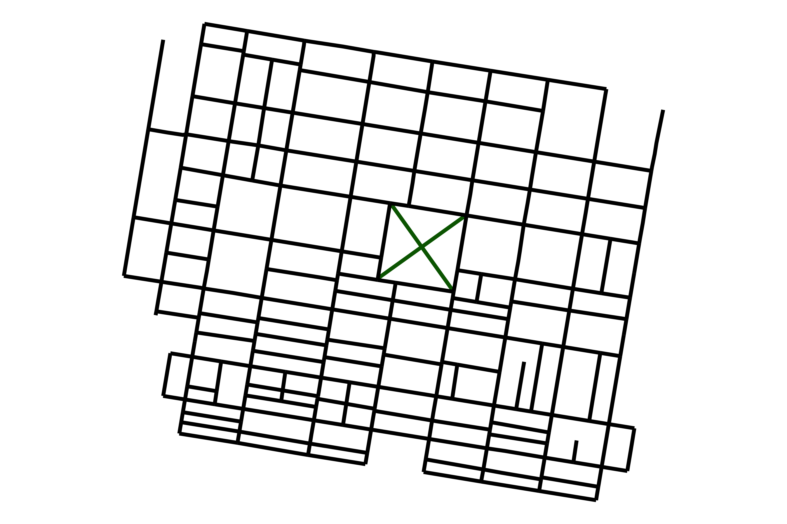

```{r setup, include=FALSE}
knitr::opts_chunk$set(echo = FALSE)
```

```{r,include=F,fig.cap="Rittenhouse Square"}

```

There's nothing like a good blog when you're trying to dig into a subject and learn a bit more than you did previously.


In contrast to their sexier siblings, the podcast and video essay, blogs allow for both a speedy read or an in-depth plunge with equal enjoyment. Good blogs are also a labor of love, written just as much for the sake of satisfying the author's own interest in a subject, as they are to provide material for a viewership.

With this blog, I'm hoping to check all the above boxes. The subject of interest, as the blog title may hint, lies at the intersection of statistics and the built environment.
This is a broad area, with which I have some [familiarity](http://apetersonsite.org/), 
but even in my dissertation work I have barely scratched the surface of what's out there.
So, though I may no longer be a formal academic, I still intend to delve deeper 
into those subjects in this space that I find interesting at my leisure.
These may include ecological and socially relevant ideas like [tree cover differences](https://www.nature.com/articles/s42949-021-00022-0) 
across neighborhoods, statistically interesting ideas of how to
adjust an analysis for causal inference with [interference](https://arxiv.org/abs/1702.03578), or more economically 
grounded ideas that focus on debt service in [suburban growth patterns](https://www.strongtowns.org/journal/2018/8/22/the-more-we-grow-the-poorer-we-become).
Politics, economics, justice – and the competing claims of what constitutes justice –
I suspect I won't run out of material to write about. 


While I hope to keep my writing as accessible as possible and discuss the 
material of interest in such a way that minimal prior knowledge is typically 
needed, I will also, not infrequently, dig into technical matters in some detail.
I will do my best to provide summary comments and label such posts so that
some hint of what they offer may be understood to those not technically trained.


Above all else, it is my hope that this blog will offer the opportunity to 
deepen an appreciation for this incredibly fascinating subject at a time when
it is woefully overlooked and yet more important than ever.

Happy Reading!